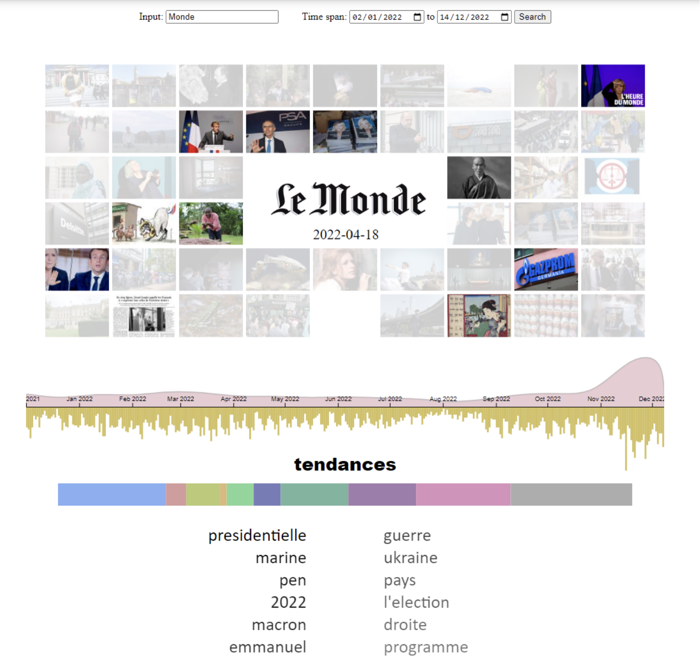

# Le Monde data visualization (Dec. 2022)
A project to collect written data of articles from the French newspaper Le Monde and display trends over time in an interactive manner. This project was conducted in the scope of L'Ecole Polytechnique's course on Data-Visualization. 

## Scrapper
The scrapper is written in python and usees urllib to access the html code of Le Monde's archive site: https://www.lemonde.fr/archives-du-monde/. Through some clever tricks, the program can find the titles, descriptions, hyperlinks etc from the HTML code. The data is then stored in an excel file, which can then be exploited for the data visualization in javascript.

Data is scrapped from 2022 only, as any more than a years worth data tends to increase latency of the datavisualization interface. However it is possible, given enough time, to scrape all articles from 1945 onwards. The program is intentionally slowed down to not get banned from the archive site (which probably limits requests from individual IPs for protection against ddos attacks). The scrapper may not work for future versions of the website (post 2022). It also is subject to some bugs which were not resolved.

## Visualization

The visualization alows to search for keywords in article titles and descriptions. The amount of times keywords have benn used for each day is then displayed with a histogram. Individual days can be selected to see what main keywords were at the time. Selecting a given day will also display a grid of that days cover photos.

## Sample Video 

A sample video can be found and downloaded in the repository.

## Contributors
Hugo Bouigeon